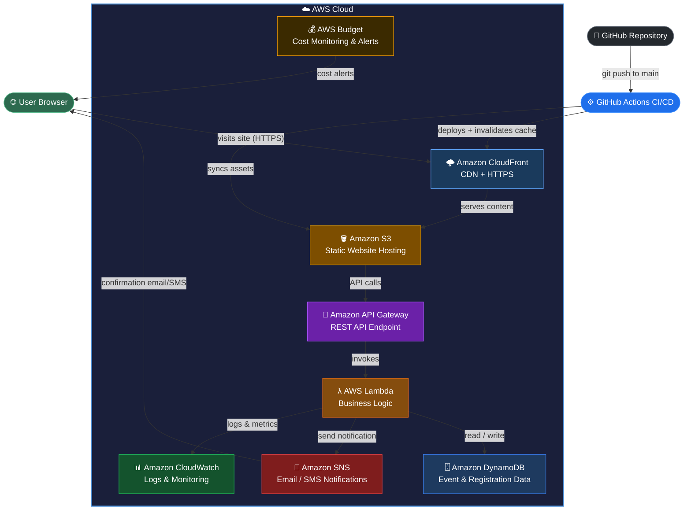

# Othniel's Serverless Event Registration & Ticketing

**Live Application (CloudFront):** https://dqinofc0m9op.cloudfront.net/

**S3 Origin URL:** http://othniel-capstone-project-082026.s3-website-us-east-1.amazonaws.com/

A fully serverless event registration and ticketing web application hosted on AWS, with automated CI/CD deployment via GitHub Actions.

---

## Table of Contents

- [Project Overview](#project-overview)
- [Architecture](#architecture)
- [AWS Services Used](#aws-services-used)
- [Project Structure](#project-structure)
- [Lambda Functions](#lambda-functions)
- [CI/CD Pipeline](#cicd-pipeline)
- [GitHub Secrets Setup](#github-secrets-setup)
- [IAM Permissions](#iam-permissions)
- [S3 Bucket Configuration](#s3-bucket-configuration)
- [CloudFront Configuration](#cloudfront-configuration)
- [AWS Budget Configuration](#aws-budget-configuration)
- [How to Deploy](#how-to-deploy)
- [Local Development](#local-development)

---

## Project Overview

This is a static frontend web application that allows users to browse events, register, and receive tickets. The frontend is built with plain HTML, CSS, and JavaScript and is hosted on an AWS S3 bucket as a static website, served globally via Amazon CloudFront. All backend logic is handled by serverless AWS services.

---

## Architecture



---

## AWS Services Used

| Service | Purpose |
|---|---|
| **S3** | Hosts the static frontend (HTML, CSS, JS) |
| **CloudFront** | CDN — serves site over HTTPS globally, caches assets at edge locations |
| **API Gateway** | Exposes REST API endpoints consumed by the frontend |
| **Lambda** | Handles all backend logic — events, registrations, notifications |
| **DynamoDB** | Stores event data and user registrations |
| **SNS** | Sends confirmation email/SMS notifications to registered users |
| **CloudWatch** | Monitors Lambda executions, logs errors and metrics |
| **AWS Budget** | Tracks actual and forecasted costs, sends alerts when thresholds are exceeded |

---

## Project Structure

```
Serverless_Event_Registration/
├── .github/
│   └── workflows/
│       └── deploy.yml           # GitHub Actions CI/CD pipeline
├── backend_codes/
│   ├── get_events.py            # GET /events and GET /events/{id}
│   ├── get_registrations.py     # GET /registrations and GET /registrations?email=x
│   ├── post_registration.py     # POST /registrations
│   ├── sns_notification.py      # SNS confirmation notification trigger
│   ├── update_event.py          # PUT /events/{id} — future use
│   └── delete_event.py          # DELETE /events/{id} — future use
├── architecture.html            # Visual architecture diagram
├── index.html                   # Main frontend application
└── README.md                    # Project documentation
```

---

## Lambda Functions

### Currently Active

| File | Method | Path | Description |
|---|---|---|---|
| `get_events.py` | GET | `/events` `/events/{id}` | Fetches all events or a single event by ID from DynamoDB |
| `get_registrations.py` | GET | `/registrations` `/registrations?email=x` | Returns all registrations (admin) or filters by email (user lookup) |
| `post_registration.py` | POST | `/registrations` | Registers a user for an event, saves record to DynamoDB |
| `sns_notification.py` | — | Triggered after POST | Sends a confirmation email/SMS to the registered user via SNS |

### Created for Future Use

| File | Method | Path | Description |
|---|---|---|---|
| `update_event.py` | PUT | `/events/{id}` | Updates an existing event's details (name, date, venue, seats) in DynamoDB. Not yet wired to the frontend but available for an admin dashboard feature. |
| `delete_event.py` | DELETE | `/events/{id}` | Deletes an event record from DynamoDB. Reserved for an admin event management panel in a future release. |

---

## CI/CD Pipeline

Deployment is automated using **GitHub Actions**. Every push to the `main` branch triggers the pipeline which deploys the site to S3 and invalidates the CloudFront cache.

### Workflow file: `.github/workflows/deploy.yml`

```yaml
name: Deploy to S3

on:
  push:
    branches:
      - main

jobs:
  deploy:
    runs-on: ubuntu-latest

    steps:
      - name: Checkout code
        uses: actions/checkout@v4

      - name: Configure AWS credentials
        uses: aws-actions/configure-aws-credentials@v4
        with:
          aws-access-key-id: ${{ secrets.AWS_ACCESS_KEY_ID }}
          aws-secret-access-key: ${{ secrets.AWS_SECRET_ACCESS_KEY }}
          aws-region: ${{ secrets.AWS_REGION }}

      - name: Upload index.html to S3
        run: |
          aws s3 cp index.html s3://${{ secrets.S3_BUCKET_NAME }}/index.html \
            --content-type "text/html" \
            --cache-control "no-cache, no-store, must-revalidate"

      - name: Sync other assets to S3
        run: |
          aws s3 sync . s3://${{ secrets.S3_BUCKET_NAME }} \
            --exclude ".git/*" \
            --exclude ".github/*" \
            --exclude "index.html" \
            --delete

      - name: Invalidate CloudFront cache
        run: |
          aws cloudfront create-invalidation \
            --distribution-id ${{ secrets.CLOUDFRONT_DISTRIBUTION_ID }} \
            --paths "/*"
```

### How it works

1. Code is pushed to the `main` branch
2. GitHub Actions checks out the repository
3. AWS credentials are configured using stored GitHub secrets
4. `index.html` is uploaded with `no-cache` headers
5. All other assets are synced to S3
6. CloudFront cache is invalidated so users always get the latest version

---

## GitHub Secrets Setup

Navigate to your GitHub repository → **Settings** → **Secrets and variables** → **Actions** → **New repository secret**, and add the following:

| Secret Name | Description |
|---|---|
| `AWS_ACCESS_KEY_ID` | IAM user access key ID |
| `AWS_SECRET_ACCESS_KEY` | IAM user secret access key |
| `AWS_REGION` | AWS region e.g. `us-east-1` |
| `S3_BUCKET_NAME` | S3 bucket name e.g. `othniel-capstone-project-082026` |
| `CLOUDFRONT_DISTRIBUTION_ID` | CloudFront distribution ID e.g. `E1XXXXXXXXX` |

---

## IAM Permissions

The IAM deploy user must have the following policy attached.

Go to **AWS Console** → **IAM** → **Users** → select your deploy user → **Add permissions** → **Create inline policy** → paste the JSON below:

```json
{
  "Version": "2012-10-17",
  "Statement": [
    {
      "Effect": "Allow",
      "Action": [
        "s3:PutObject",
        "s3:DeleteObject",
        "s3:ListBucket"
      ],
      "Resource": [
        "arn:aws:s3:::YOUR_BUCKET_NAME",
        "arn:aws:s3:::YOUR_BUCKET_NAME/*"
      ]
    },
    {
      "Effect": "Allow",
      "Action": "cloudfront:CreateInvalidation",
      "Resource": "*"
    }
  ]
}
```

> Replace `YOUR_BUCKET_NAME` with your actual S3 bucket name.

---

## S3 Bucket Configuration

### 1. Enable Static Website Hosting
- Go to your S3 bucket → **Properties** → **Static website hosting**
- Enable it and set **Index document** to `index.html`

### 2. Disable Block Public Access
- Go to **Permissions** → **Block public access** → turn **OFF** all options

### 3. Add Bucket Policy
- Go to **Permissions** → **Bucket Policy** → paste the following:

```json
{
  "Version": "2012-10-17",
  "Statement": [
    {
      "Effect": "Allow",
      "Principal": "*",
      "Action": "s3:GetObject",
      "Resource": "arn:aws:s3:::YOUR_BUCKET_NAME/*"
    }
  ]
}
```

> Replace `YOUR_BUCKET_NAME` with your actual S3 bucket name.

---

## CloudFront Configuration

CloudFront sits in front of S3 to serve the site over HTTPS with global edge caching.

### Setup Steps

1. **AWS Console** → **CloudFront** → **Create distribution**
2. Set **Origin domain** to your S3 static website endpoint
3. Set **Viewer protocol policy** to `Redirect HTTP to HTTPS`
4. Set **Default root object** to `index.html`
5. Set **Cache policy** to `CachingOptimized`
6. Click **Create distribution** and wait 5–10 minutes for deployment

### Benefits
- Site is served over **HTTPS** automatically
- Assets are cached at **edge locations** worldwide for faster load times
- Every `git push` triggers a **cache invalidation** via GitHub Actions so users always get the latest version

---

## AWS Budget Configuration

AWS Budget is configured to monitor and alert on actual and forecasted costs.

### Setup Steps

1. **AWS Console** → **Billing** → **Budgets** → **Create budget**
2. Select **Cost budget**
3. Set your **monthly budget amount** e.g. `$10`
4. Under **Alerts**, set:
   - Alert threshold: `80%` of budgeted amount
   - Alert type: **Actual** and **Forecasted**
   - Email recipients: your email address
5. Click **Create budget**

### What it monitors
- Tracks spending across all AWS services used in this project (S3, Lambda, DynamoDB, SNS, CloudFront, API Gateway)
- Sends an email alert when actual or forecasted spend reaches the defined threshold
- Helps prevent unexpected charges during development and production

---

## How to Deploy

### First-time setup

```bash
git clone https://github.com/<your-username>/<your-repo>.git
cd Serverless_Event_Registration
git remote -v
```

### Push changes to trigger deployment

```bash
git add .
git commit -m "your commit message"
git push origin main
```

The GitHub Actions pipeline will automatically deploy your changes to S3 and invalidate the CloudFront cache.

### Monitor deployment
- Go to your GitHub repository → **Actions** tab to see the pipeline running
- Go to **AWS CloudWatch** to monitor Lambda logs and errors

---

## Local Development

Since this is a plain HTML/CSS/JS project, you can open it directly in your browser:

```bash
# Option 1 — open directly
start index.html

# Option 2 — use VS Code Live Server extension
# Right-click index.html → Open with Live Server
```

No build step or package installation is required.

---

## Contributors

-  Othniel Asante Takyi
